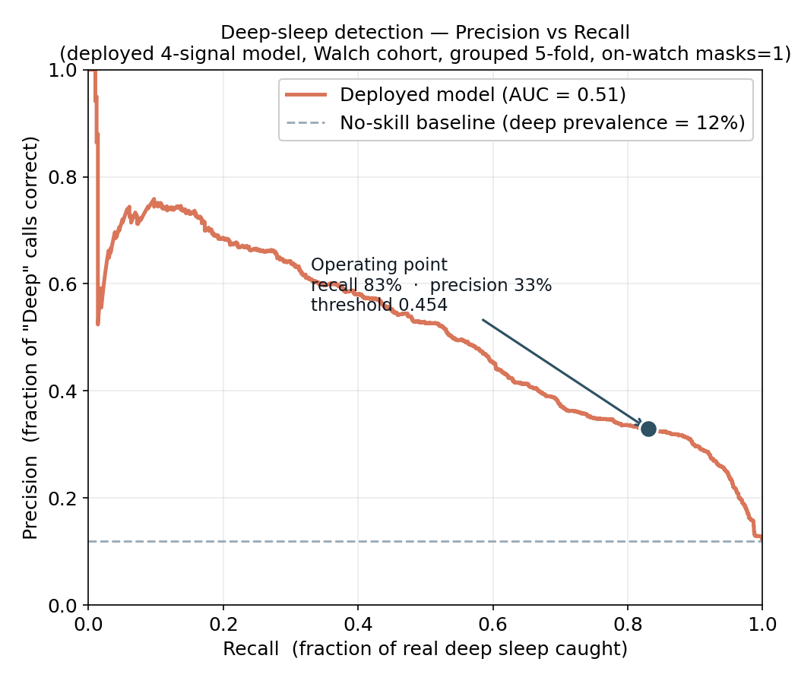
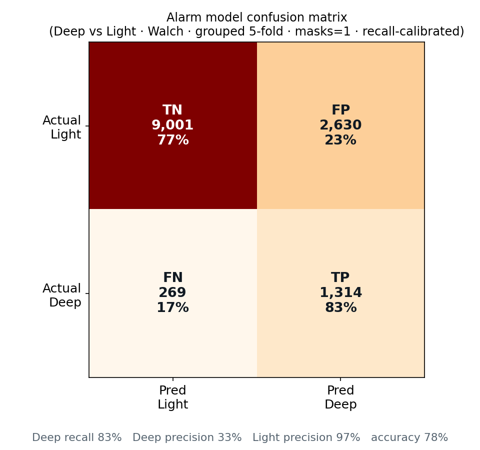
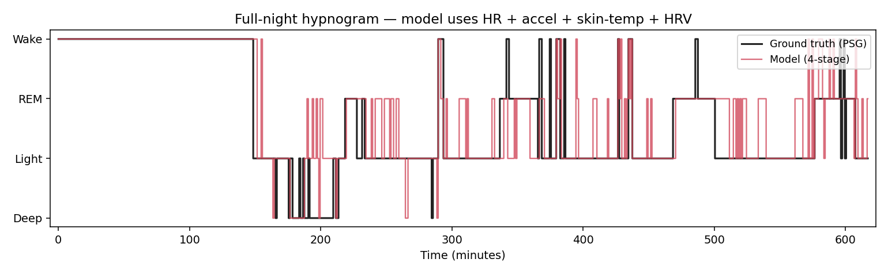
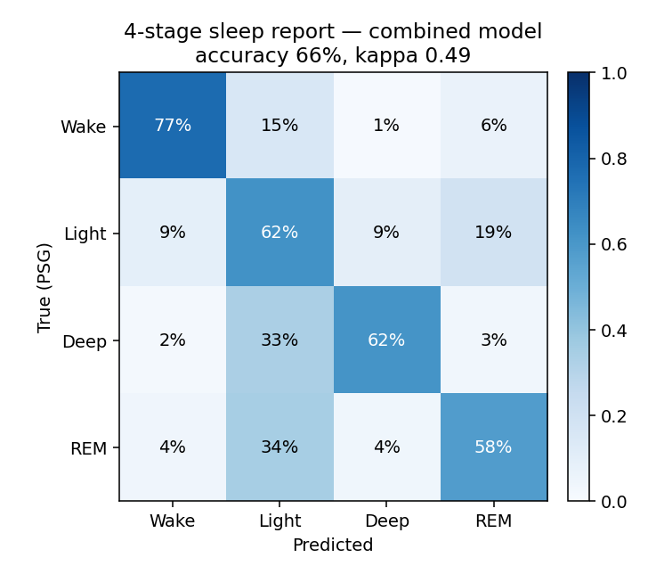

# SleepWise — Sleep-Stage Models (training & research)

On-device sleep-stage classification for the **SleepWise** smart alarm. A phone runs
a TensorFlow Lite model on live signals streamed from a Galaxy Watch and wakes the
user during **light sleep** within their chosen window — all inference on-device,
offline, with a guaranteed fallback alarm. This repo holds the **model-training
pipeline and experiments**; the Android app and FastAPI backend live in separate repos.

Two deployable models, both a small dense NN over the **same 45-feature vector** (rebuilt
on-device to match this pipeline exactly, per-1-minute epoch):

| Model | Job | Classes | Input |
|---|---|---|---|
| **Alarm** | the wake decision | Deep vs Light | HR + accel + skin-temp + HRV |
| **Report** | the morning hypnogram (display only) | Wake / Light / Deep / REM | same 45 features |

Trained on **3 pooled cohorts — Walch + DREAMT + Wearanize+ (120 subjects, 3 devices,
59,445 epochs)** with presence masks (`has_temp` / `has_hrv`) so the model degrades
gracefully when a signal is missing.

---

## The turning point: a model that aced the lab and failed on the wrist

The first model looked great on paper but tagged whole real nights as "Light." The
gap traced to **three separate bugs, each enough to sink it on its own** — all fixed:

| # | Root cause | Fix | Effect (Deep) |
|---|---|---|---|
| 1 | **Data leakage** — a random split put the same subject's epochs in train *and* test, so the model recognised *people*, not sleep | participant-**grouped** 5-fold CV | inflated **89%** recall → honest **~46%** |
| 2 | **Train/serve skew** — trained on real skin-temp, but the watch had no live temp then, so inference fed a constant 34 °C (3 features frozen out-of-distribution) | retrain with temp pinned to the same constant | recall **37% → 86%** |
| 3 | **Wrong teacher** — DREAMT is a sleep-apnea cohort with only **3.5%** deep sleep | add healthy, consumer-watch cohorts (Walch, Wearanize+) | see results |

> **Every metric below is grouped-by-subject 5-fold CV** — no subject appears in both
> train and test — measured at the on-watch operating condition (`masks=1`).

---

## Results — the alarm model (Deep vs Light)

The alarm is tuned for **high Deep recall**: missing deep sleep (waking you in it) is
the product failure; over-calling deep just makes the alarm *wait*, and a fallback
covers it. So we operate at **83% recall** and accept lower precision.

<p align="center">
  
  
</p>

**Deployed model — 3 cohorts, 45 features, Walch cohort @ 83% recall:**

| Metric | Value | Reading |
|---|---|---|
| **Deep recall** | **83%** | of real deep sleep, how much we avoid waking you in |
| **Light precision** | **97%** | **when the alarm rings, you're really in light sleep** |
| Deep precision | ~35% | intentionally low — asymmetric error cost |
| Overall accuracy | ~78% | — |

**Why 4 signals didn't hurt the alarm** — the story of the 3rd cohort:

| Alarm model (Walch, 83% recall) | Deep precision |
|---|---|
| HR + accel only (baseline **B0**) | **35.4%** |
| + temp + HRV, 2 cohorts (Walch + DREAMT) | 23.7% ❌ |
| + temp + HRV, **3 cohorts (+ Wearanize+)** | **35.6%** ✅ ties B0 |

With only DREAMT supplying temp/HRV, "sensors present" became a proxy for "apnea
patient → little deep sleep," and the model drifted (23.7%). Adding a **healthy**
cohort with all four signals (Wearanize+) broke that confound — so the deployed model
consumes all four signals at **no cost** to the wake decision.

**Honest finding:** temp/HRV don't *improve* the wake decision (HR + accel already
carry it) — but once the confound is broken they no longer *harm* it, so they ship,
and they power the report below. This reproduces the literature (see citations).

---

## Results — the 4-stage report model (Wake / Light / Deep / REM)

A separate, display-only model behind the morning hypnogram — **not** the wake
decision. Same 45 features, softmax over 4 stages. **This is where temp + HRV earn
their keep.**

<p align="center">
  
  
</p>

Grouped 5-fold: **overall accuracy 67%, Cohen's κ ≈ 0.48** — within the published
wearable 4-stage range (κ 0.49–0.66). Per stage (P/R): Wake 76/78 · Light 71/71 ·
Deep 41/49 · REM 43/36. REM stays the hardest class (an honest, literature-consistent
limitation).

---

## Datasets (download separately — NOT in this repo)

PhysioNet/Radboud licenses prohibit redistribution and the files are multi-GB.

| Dataset | Device | Signals | Subjects | Deep % | Population |
|---|---|---|---|---|---|
| **Walch 2019** "sleep-accel" | Apple Watch | HR, accel | 31 | ~12% | healthy |
| **DREAMT** | Empatica E4 | HR, accel, **temp, IBI→HRV** | ~69 | 3.5% | sleep-apnea |
| **Wearanize+** (OA) | Empatica E4 | HR, accel, **temp, HRV** | 20 | 17% | healthy |

- Walch: https://physionet.org/content/sleep-accel/1.0.0/ → `data/sleep-accel-dl/...`
- DREAMT: https://physionet.org/content/dreamt/2.0.0/ → `data/dreamt/S*_whole_df.csv`
- Wearanize+: Radboud open-access (RDR WebDAV) → `wearanize_feats.pkl`

Multi-cohort pooling gives volume + **device diversity** (3 devices) so the model
learns device-invariant patterns instead of overfitting one wristband.

---

## Pipeline

```bash
conda activate sleepwise            # TF 2.16, scikit-learn, pandas, matplotlib

# feature extraction (per cohort → cached .pkl)
python src/extract_cache.py                  # DREAMT
python src/load_sleepaccel.py                # Walch
python src/extract_wearanize.py              # Wearanize+

# the failure story (leakage + temp bug, on DREAMT)
python src/experiment_temp_bug.py

# train + export the DEPLOYED models (→ models/…/  .tflite + metadata)
python src/build_deploy_model.py             # alarm: binary Deep/Light, 45 feat, 3 cohorts
python src/build_report_deploy.py            # report: 4-stage Wake/Light/Deep/REM

# figures used above
python src/plot_pr_curve.py                  # docs/figures/pr_curve.png
python src/plot_confusion.py                 # docs/figures/confusion_alarm.png
python src/build_report_figures.py           # report hypnogram + confusion
```

## Key files

| File | What |
|---|---|
| `src/features.py` | Feature extraction + label schemes (`binary_n3`, `4class`) |
| `src/build_combined_model.py` | Pooled 3-cohort loader + XGBoost research eval (per-cohort metrics) |
| `src/build_deploy_model.py` | Trains + exports the **alarm** tflite (45 feat, masks, modality dropout) |
| `src/build_report_deploy.py` | Trains + exports the **4-stage report** tflite |
| `src/experiment_temp_bug.py` | Grouped experiment isolating the temp-constant bug + leakage |
| `src/plot_pr_curve.py`, `src/plot_confusion.py` | The figures above |
| `models/deploy_v3/` | Deployed alarm model (`.tflite` + metadata) |
| `models/report_v1/` | Deployed 4-stage report model |
| `EXPERIMENTS.md` | Full experiment ledger (C1/C3, deploy tests, 3rd cohort, report) |

---

## Design notes

- **Two models, one feature vector.** The alarm decides; the report visualises. Both
  read the identical on-device 45-feature vector — parity-checked against this
  pipeline (`src/parity_check.py`).
- **Runtime stabilisation.** The alarm's raw per-minute output is smoothed (EMA α=0.3)
  and gated by dual-threshold **hysteresis (0.55 / 0.35)** + a **3-epoch stability
  gate** before it may fire — so a single noisy minute can't trigger it.
- **Asymmetric cost by design.** Over-calling Deep just waits (fallback covers it);
  under-calling Deep would wake you *from* deep sleep. Hence high recall, tolerated
  precision.
- **HR carries the signal.** Across five experiments, wrist temp/HRV — even with
  frequency-domain LF/HF and per-subject normalisation — don't beat HR + accel for
  staging. We use them in the report, not the wake decision. Matches Sridhar 2020,
  Walch 2019, Kräuchi 1999.
